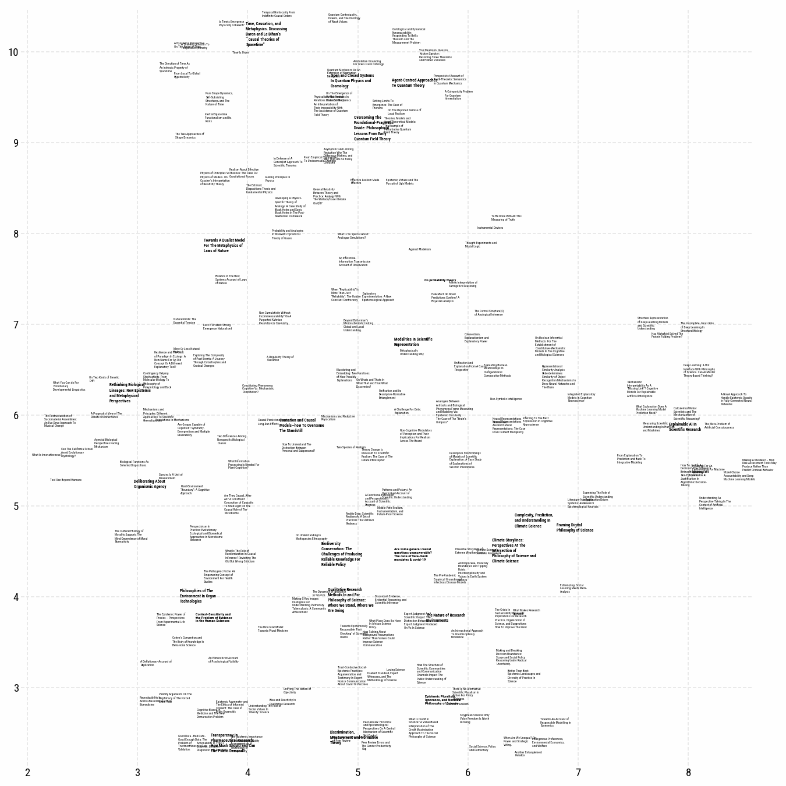

# pylabeladjust

`pylabeladjust` is a port of Gephi's Label-Adjust algorithm to python. It makes labels in matplotlib-plots not overlap by carefully pushing them apart, as illustrated by this video:



Pylabeladjust uses `pyqtree` in the background to be efficient. The setup of the `pylabeladjust`-plotting code takes inspiration from `adjust_text`. this package

# When to use `pylabeladjust`

`pylabeladjust` currently is meant for cases in which it is fine for your labels to move a little bit as in network-graphics or UMAP/t-SNE-plots, without any additional constraints. It should be able to handle cases where you have large numbers (1000+) of labels with a lot of overlap in reasonably small amounts of time. This makes it an alternative to `adjust_text` for this specific use-case, which in my experience struggles with many-abel/large overlap scenarios. If you need your labels to conform to more complicated constraints, like not overlapping particular points you might want to look into `adjust_text` and ... , which both can be very useful!


# Installation

Installation should be straightforward using:

````
pip install pylabeladjust
````

# Usage

The full usage of the package is demonstrated in the `examples.ipynb` notebook. Basic usage might look like this:


```
fig, ax = plt.subplots(figsize=(15, 15))
ax.scatter(data['x'], data['y'], s=20, alpha=.0, c='#a7510f') # plot a transparant scatterplot, to make the albels show up.
texts = []
for i, row in data.iterrows():
    texts.append(ax.text(row['x'], row['y'], textwrap.fill(row['title'],25) , fontsize=row['fontsize'],ma='left',fontweight=row['fontweight'],zorder=10))
fig.canvas.draw()

        
rectangles_adjusted = adjust_texts(texts, speed=.03, max_iterations=250, margin_percentage=6, radius_scale=1.03)
plt.show()
```


Result:


Here's what the parameters mean:


* `texts` (List[matplotlib.text.Text]): A list of text objects to be adjusted.
* speed (float, optional): The speed of the adjustment process (movement, measured on the scale of the data). If left blank, speed is set to halve the size of the mean text-width. If your labels end up all over the place, you might want to decrease this value. If it looks like the adjustment didn't change much, although the algorithm spent dozens of seconds optimizing, the value might need to be increased.
* adjust_by_size (bool, optional): Whether to adjust the texts based on their sizes. Defaults to True. This makes the positions of large text-blocks more robust, and shuffles smaller ones around more, which can result in a structurally more convincing layout, and speeds up the algorithms. You should check that small stuff didn't get shuffled awayy *too* far though. 
* radius_scale (float, optional): The scale factor for the radius used in the adjustment process. Defaults to 1.1.
* max_iterations (int, optional): The maximum number of iterations for the adjustment process. Defaults to 200. Increase if your layout still has overlaps after running the adjustment. This can usually be increased liberally because once there is little overlap anymore, the remaining iterations are very fast.
* plot_progress (bool, optional): Whether to print out plots of the progress of the adjustment process. Defaults to False, and is mostly useful for debugging.
* margin_percentage (int, optional): The percentage of margin to be added around the adjusted texts. Calculated from the width of rectangles. Defaults to 10.
* return_optimization_process (bool, optional): Whether to return the optimization process, a list of dataframes of all the positions the texts went through in the optimization process. Defaults to False.

The function edits your `texts` object in place, so you can just resume plotting. It also will return a dataframe of the new positions, and if `return_optimization_process` is set to true, a list of dataframes of the intermediate steps.