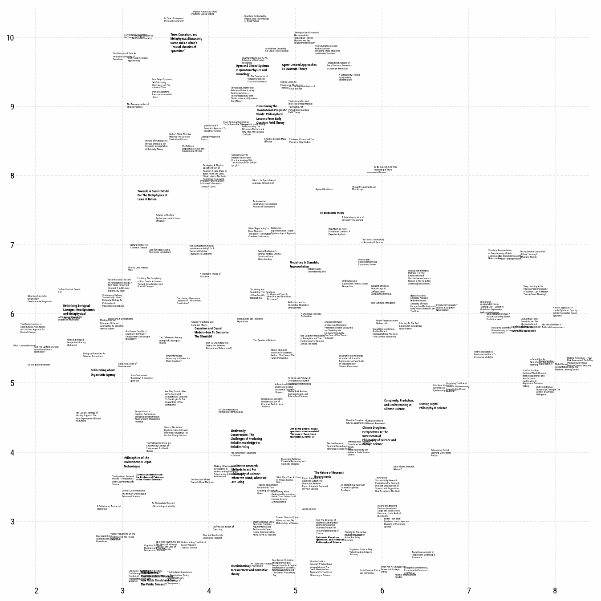

# pylabeladjust

`pylabeladjust` is a port of Gephi's Label-Adjust algorithm to python. It makes labels in matplotlib-plots not overlap by carefully pushing them apart, as illustrated by this video:



Pylabeladjust uses the very useful `pyqtree` in the background to be efficient. The setup of the plotting code takes inspiration from adjust_text. this package

# Installation


# Usage

The full usage of the package is demonstrated in the examples.ipynb` notebook. Basic usage might look like this:


```
fig, ax = plt.subplots(figsize=(15, 15))
ax.scatter(data['x'], data['y'], s=20, alpha=.0, c='#a7510f')
texts = []
for i, row in data.iterrows():
    texts.append(ax.text(row['x'], row['y'], textwrap.fill(row['title'],25) , fontsize=row['fontsize'],ma='left',fontweight=row['fontweight'],zorder=10))
fig.canvas.draw()

        
rectangles_adjusted = adjust_texts(texts, speed=.03, max_iterations=250, margin_percentage=6, radius_scale=1.03)
plt.show()
```


The function `adjust_texts` is designed to adjust the positions of texts on a plot to avoid overlapping. It accepts several parameters: `texts` is a list of matplotlib text objects that need adjustment. `speed`  sets the speed of the adjustment process. If left blank, speed is set to halve the size of the mean text-width. If your labels end up all over the place, you might want to decrease this value. If `adjust_by_size` is set to `true`, which is the default, the adjustment will consider the sizes of texts. The `radius_scale` parameter, with a default of `1.1`, modifies the radius used in the adjustment process.

 The function can run up to `max_iterations`, to find the optimal text positioning. You might want to increase this value if labels still overlap.  The `plot_progress` shows a progress bar using `tqdm`.  The `margin_percentage` sets the added margin around texts, calculated as a percentage of the width of rectangles, and defaults to `10%`. Lastly, `return_optimization_process` can be set to return the optimization process, though it defaults to `false`. The function then returns a pandas DataFrame containing the adjusted positions of the texts.


# When to use `pylabeladjust`

`pylabeladjust` currently is meant for cases in which it is fine for your labels to move a little bit as in network-graphics or UMAP/t-SNE-plots, without any additional constraints. It should be able to handle cases where you have large numbers (1000+) of labels with a lot of overlap in reasonably small amounts of time. This makes it an alternative to adjust_text for this specific use-case, which doesn't handle that scenario that well. If you need your labels to conform to more complicated constraints, you might look into ... ..., which both can be very useful!


